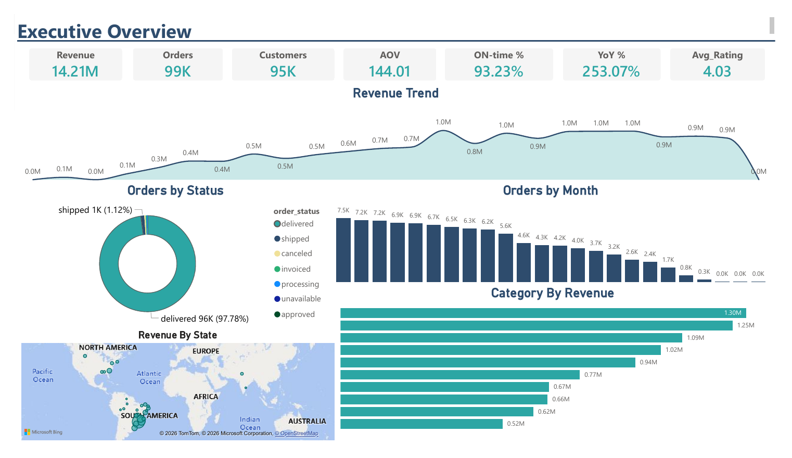
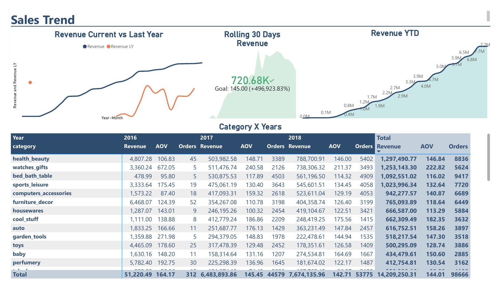
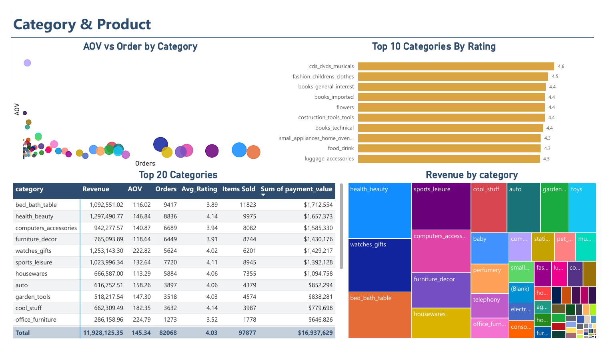
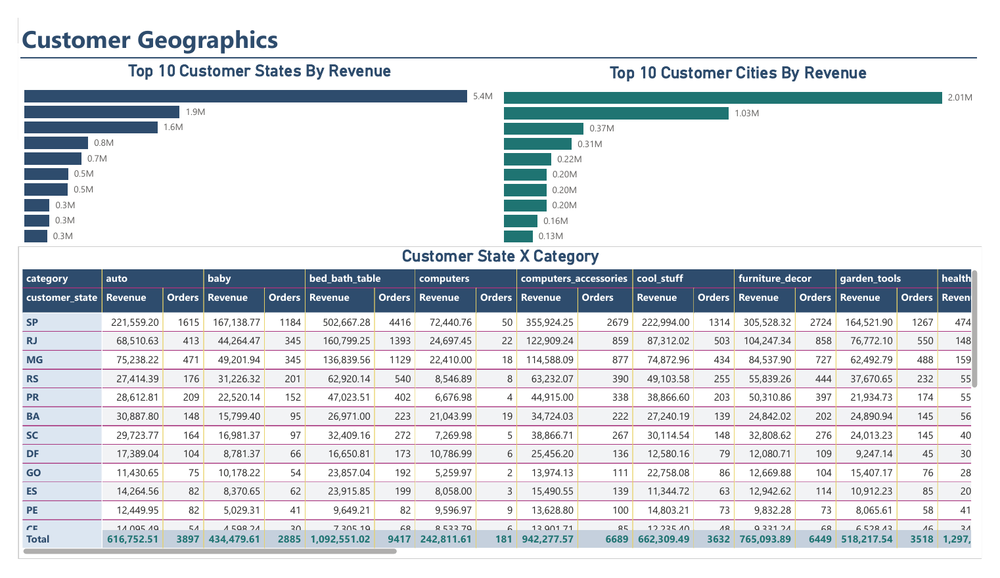
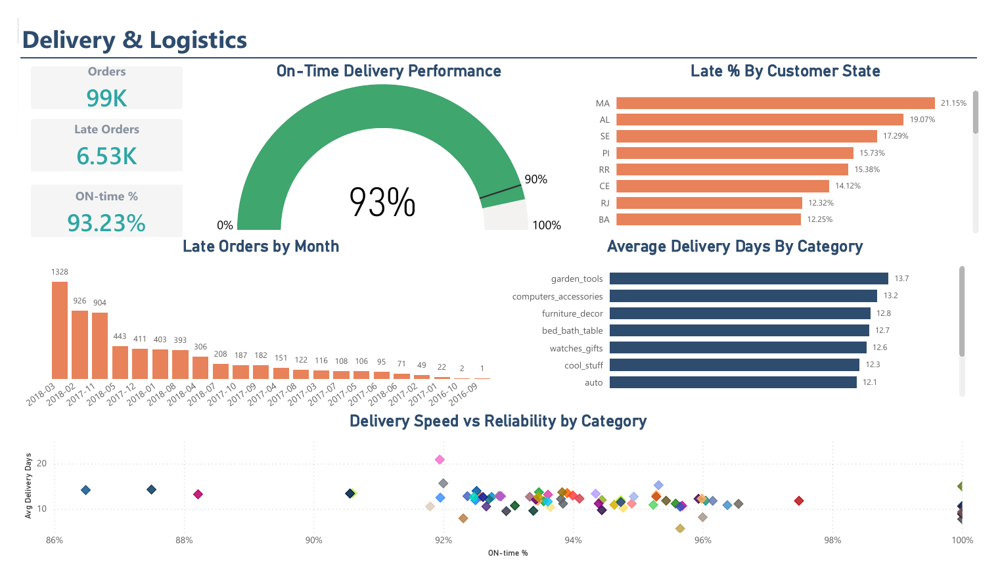
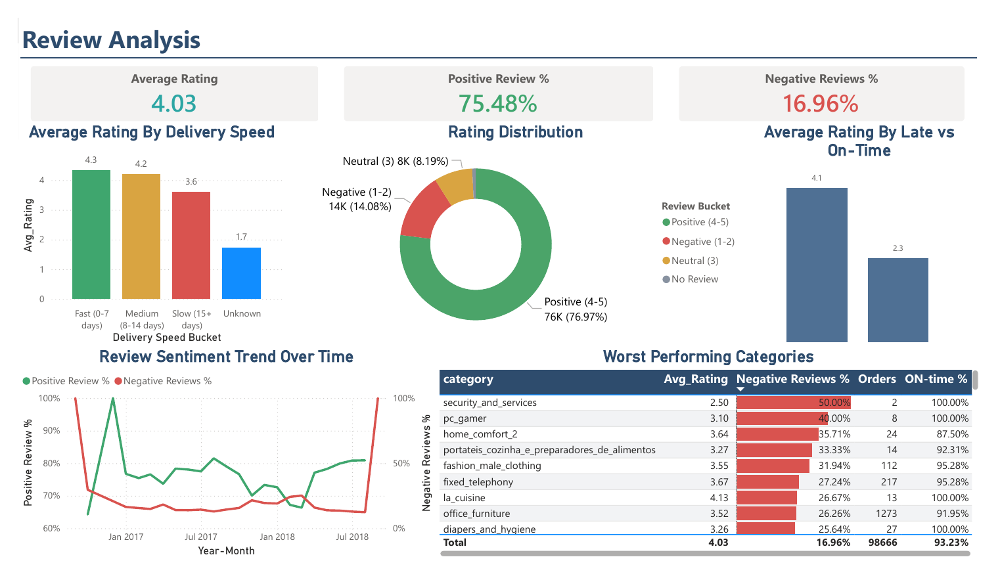
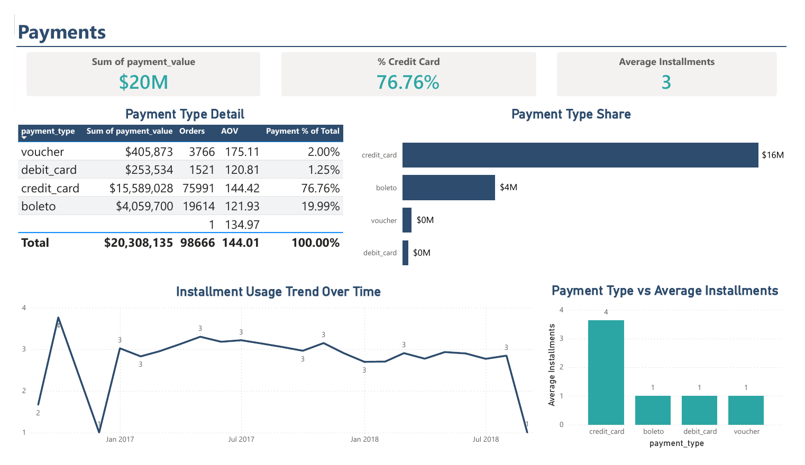
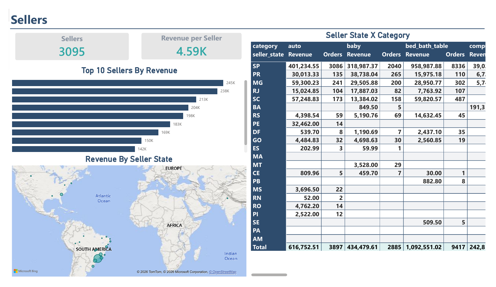
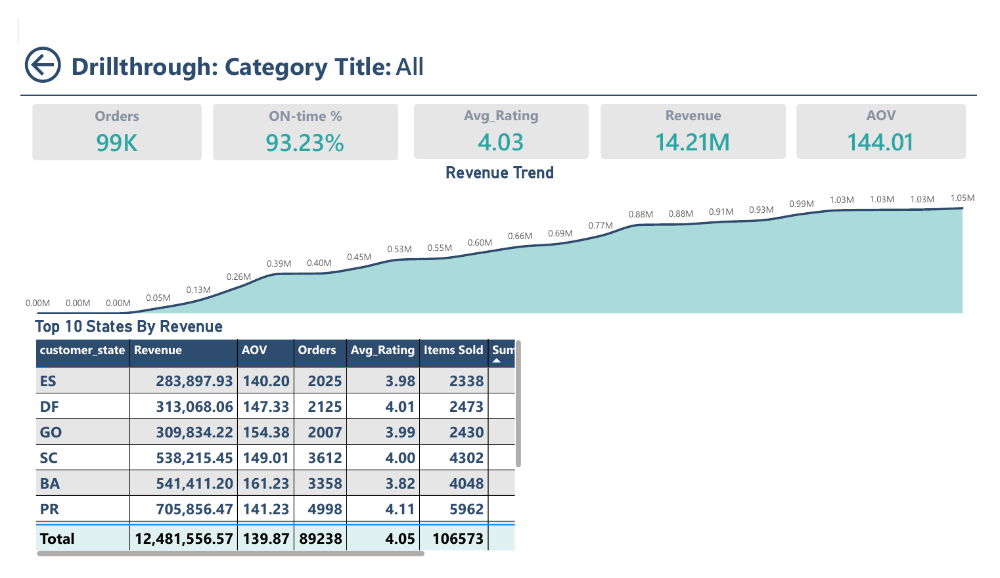
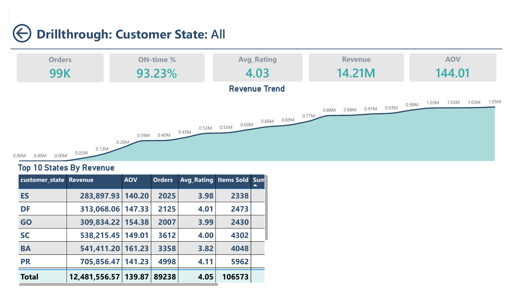

# Olist Sales Analysis

An end-to-end business intelligence project: the public Olist Brazilian e-commerce dataset is loaded into **PostgreSQL**, validated, modelled with SQL views, and analysed in a 10-page **Power BI** report using DirectQuery.



## Data source

[Brazilian E-Commerce Public Dataset by Olist](https://www.kaggle.com/datasets/olistbr/brazilian-ecommerce) on Kaggle: roughly 100,000 orders placed on Brazilian marketplaces between 2016 and 2018, with customers, items, payments, reviews, products and sellers.

The dataset is **not included in this repository**. The CSV files total about 120 MB (the geolocation file alone is over 50 MB), which is too large for GitHub, and the data is published under CC BY-NC-SA 4.0, so it should be downloaded from its original source.

**To get it:** download it from the Kaggle page (a free account is required), or use the Kaggle CLI from the project root:

```bash
kaggle datasets download -d olistbr/brazilian-ecommerce
unzip brazilian-ecommerce.zip -d data/
```

Create a `data/` folder in the project root and place the nine CSV files used by this project in it. The folder is excluded by `.gitignore`, so the files will not be committed by accident.

| File | Loaded into table |
|------|-------------------|
| `olist_customers_dataset.csv` | `olist_customers_dataset` |
| `olist_geolocation_dataset.csv` | `olist_geolocation_dataset` |
| `olist_order_items_dataset.csv` | `olist_order_items_dataset` |
| `olist_order_payments_dataset.csv` | `olist_order_payments_dataset` |
| `olist_order_reviews_dataset.csv` | `olist_order_reviews_dataset` |
| `olist_orders_dataset.csv` | `olist_orders_dataset` |
| `olist_products_dataset.csv` | `olist_products_dataset` |
| `olist_sellers_dataset.csv` | `olist_sellers_dataset` |
| `product_category_name_translation.csv` | `product_category_name_translation` |

## Business questions

- How do revenue, orders and average order value trend over time, and how do they compare with the previous year?
- Which product categories and customer states drive sales?
- How reliable is delivery, and which regions and categories miss their estimated dates most often?
- How do delivery performance and customer ratings relate?
- How do customers pay (payment type and instalments)?
- Which sellers and seller regions supply the most revenue?

## Architecture

```
Raw Olist CSVs
      |
      v
PostgreSQL base tables      (primary and foreign keys, validation checks, B-Tree indexes)
      |
      v
BI views                    (bi_dim_product, bi_fact_review_latest, bi_fact_orders,
      |                      bi_payments_order, bi_fact_sales)
      v  DirectQuery
Power BI data model         (DimDate table, relationships, DAX measures)
      |
      v
10-page report              (8 analysis pages + 2 drillthrough pages)
```

**Tools:** PostgreSQL, SQL, Power BI Desktop, DAX.

## Repository structure

```
olist-sales-analysis/
├── README.md
├── .gitignore
├── sql/
│   └── olist_sales_analysis.sql      # schema, foreign keys, validation, indexes, BI views
├── powerbi/
│   └── measures.dax                  # date table, measures and calculated column
├── docs/
│   ├── Olist_Sales_Analysis_Documentation.docx
│   └── images/                       # dashboard screenshots
└── data/                             # created by you; holds the downloaded CSVs (git-ignored)
```

## What is in the SQL

- **Schema and constraints:** nine tables with primary keys and foreign keys between orders, customers, items, products, sellers, payments and reviews.
- **Validation:** row counts, null checks on required columns, and key-uniqueness checks.
- **Views for Power BI:**
  - `bi_dim_product` adds English category names and package volume.
  - `bi_fact_review_latest` keeps one review per order.
  - `bi_fact_orders` derives delivery days and an `is_late` flag (delivered after the estimated date).
  - `bi_payments_order` summarises payments to one row per order, so orders with several payments do not duplicate sales rows.
  - `bi_fact_sales` is the item-level fact table that Power BI reads.
- **Checks on the views:** the sales view must have exactly one row per order item, and its revenue must equal the base table.

## Report pages

| # | Page | Focus |
|---|------|-------|
| 1 | Executive Overview | Headline KPIs, revenue trend, order status, top categories, revenue by state |
| 2 | Sales Trend | Revenue vs last year, rolling 30 days, year-to-date, category by year |
| 3 | Category & Product | AOV vs orders, top-rated categories, category table and treemap |
| 4 | Customer Geographics | Top states and cities by revenue, state by category matrix |
| 5 | Delivery & Logistics | On-time rate vs target, late orders by state and month, delivery days |
| 6 | Review Analysis | Rating and sentiment, rating by delivery speed, worst categories |
| 7 | Payments | Payment type share, instalments, payment detail |
| 8 | Sellers | Seller KPIs, top sellers, seller state by category |
| 9-10 | Drillthrough | Category and customer-state drillthrough pages |












## How to reproduce

1. **Get the data.** Download the CSV files as described in [Data source](#data-source) and place them in a `data/` folder.
2. **Create a database.** For example `CREATE DATABASE olist;` in PostgreSQL.
3. **Create the tables.** Run section 1 (Schema) of `sql/olist_sales_analysis.sql`.
4. **Load the CSVs.** From `psql`, run the `\copy` commands listed in section 2 of the SQL file. Load customers, sellers, products and orders before the tables that reference them, since the foreign keys are added in the next step.
5. **Add constraints, checks, indexes and views.** Run sections 3 to 7 of the SQL file. Sections 4 and 7 return validation results you can inspect.
6. **Build the report.** In Power BI Desktop, connect to PostgreSQL, choose **DirectQuery**, and import `bi_fact_sales`. Create the date table, measures and calculated column from [`powerbi/measures.dax`](powerbi/measures.dax), and relate `DimDate[Date]` to `bi_fact_sales[purchase_date]` (one to many).

## Documentation

The full write-up (schema, views, DAX, and a page-by-page description of the report) is in [`docs/Olist_Sales_Analysis_Documentation.docx`](docs/Olist_Sales_Analysis_Documentation.docx).

## Credits and licence

Data: Olist and André Sionek, [Brazilian E-Commerce Public Dataset by Olist](https://www.kaggle.com/datasets/olistbr/brazilian-ecommerce), published on Kaggle under CC BY-NC-SA 4.0. This is an independent analysis and is not affiliated with Olist.
